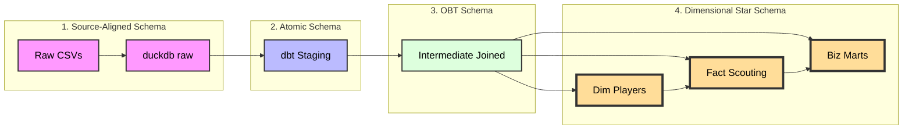
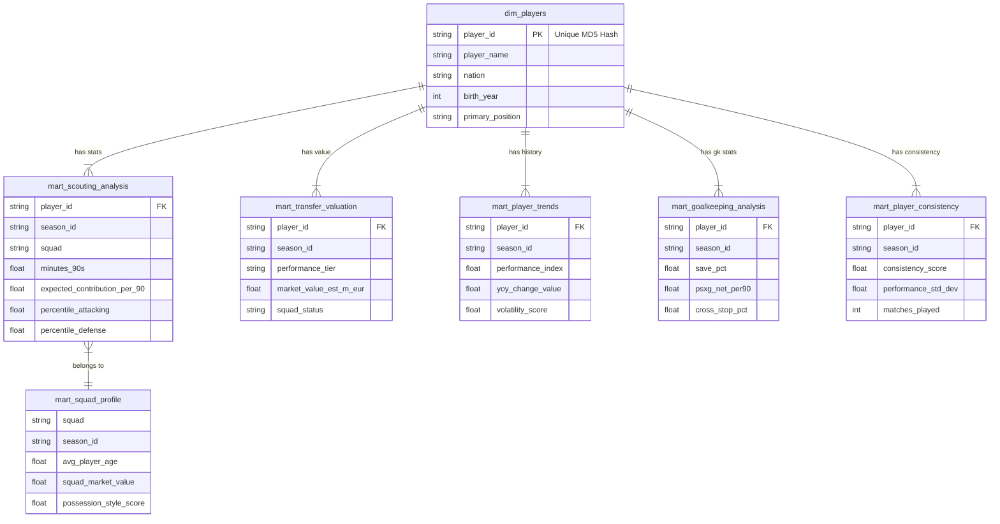

# NextGenEUPlayers - DuckDB ELT Pipeline

A robust ELT pipeline for scraping and analyzing player statistics from FBref for the Big Five European Leagues across multiple seasons (2023-2026).


## Overview

This project implements a complete data pipeline that:
1. **Extracts** player statistics from fbref.com
2. **Loads** raw data into DuckDB
3. **Profiles** data quality and schema
4. **Transforms** data into a clean staging schema ready for analysis
5. **Analyzes** data using a Streamlit dashboard

## Directory Structure

```
NextGenEUPlayers/
├── ingestion/
│   ├── fbref_scraper.py      # Extract: Web -> CSV
│   ├── scrape_glossary.py    # Extract: Glossary -> CSV
│   ├── load_raw.py           # Load: CSV -> DuckDB (raw schema)
│   ├── profile_raw.py        # Profile: Analyze raw schema stats
│   └── transform_stage.py    # (Deprecated) Old transformation script
├── transformation/           # [T] dbt Project
│   ├── models/
│   │   ├── staging/          # Cleaning & Normalization
│   │   ├── intermediate/     # Joins & Logic
│   │   └── marts/            # Final Scouting Tables
│   ├── macros/               # Reusable SQL logic
│   └── tests/                # Data Integrity Tests
├── data/
│   ├── raw/                  # Raw CSVs by season
│   ├── glossary/             # Column definition glossary
│   ├── reports/              # Data profiling reports
│   └── duckdb/               # players.db database
├── dashboard.py              # The Scouting App (Streamlit)
├── schemas/
│   └── raw/                  # Schema documentation
├── scripts/
│   └── profile_raw_schema.py # Schema profiling utilities
└── requirements.txt
```

## Pipeline Stages

### 1. Extract (Web -> CSV)
- **`fbref_scraper.py`**: Scrapes player statistics from FBref
- **`scrape_glossary.py`**: Extracts column definitions and glossary

### 2. Load (CSV -> DuckDB Raw Schema)
- **`load_raw.py`**: Loads raw CSVs into DuckDB `raw` schema
- Preserves original column names and data types
- Organizes data by season and stat category

### 3. Profile (Data Quality Analysis)
- **`profile_raw.py`**: Analyzes raw schema for:
  - Column names and positions
  - Inferred data types
  - NULL value counts
  - Total row counts
  - Glossary coverage
- **Output**: `data/reports/raw_profile.csv` or Markdown report

### 4. Transform (dbt Architecture)

We utilize a **Medallion Architecture** within dbt to turn messy web data into actionable intelligence.

#### 1. The Data Lineage (The Flow)
This diagram illustrates the transformation journey from raw web data to the final analytical tables.



#### 2. Schema Layer Dictionary

| Schema Layer | Type | Description |
| :--- | :--- | :--- |
| **Raw** | *Source-Aligned* | Exact copy of source CSVs. Untyped strings. Split by year/category. Used for audit trails. |
| **Staging** | *Atomic* | Cleaned 1:1 views. Types cast to Int/Float. Column names normalized. Identity generated (`player_id`). |
| **Intermediate** | *One Big Table (OBT)* | Massive wide tables (100+ cols). optimized for columnar DBs (DuckDB). Joins all categories (Shooting, Passing, etc.) into one. |
| **Marts** | *Star Schema* | The final presentation layer. Separates Entities (`dim_players`) from Measurements (`mart_scouting`). Contains all business logic and KPIs. |

#### 3. Layer Details

**Staging Layer (`models/staging/`)**
*   **Goal:** Clean and normalize raw data.
*   **Operations:**
    *   **Identity Resolution:** Generates a surrogate key (`player_id`) using an MD5 hash of `Name + BirthYear + Nation` to track players across different teams and seasons.
    *   **Unioning:** Dynamically combines data from 2023, 2024, and 2025 into single streams.
    *   **Type Casting:** Converts string stats to numeric types via custom macros.

**Intermediate Layer (`models/intermediate/`)**
*   **Goal:** Assemble the "Single Source of Truth."
*   **Key Model:** `int_player_season_stats`
*   **Logic:** Joins 8+ disparate sources (Standard Stats, Shooting, Passing, Defense, Possession) into a unified wide table per player per season.

**Marts Layer (`models/marts/`)**
*   **Goal:** Business logic and KPIs for the Dashboard.
*   **Key Models:**
    *   **`mart_scouting_analysis`**: Calculates **Per 90** metrics and **Percentile Ranks** relative to the player's specific position (e.g., comparing Center Backs only to other Center Backs).
    *   **`mart_player_trends`**: Tracks career trajectory and Year-over-Year growth.
    *   **`mart_transfer_valuation`**: Algorithmic estimation of market value based on performance, age, and league strength.
    *   **`mart_squad_profile`**: Aggregates team DNA to simulate transfer suitability.

#### 4. The Serving Layer (The ERD)
We focus our Entity-Relationship Diagram (ERD) on the **Marts Layer**, as this is the "Product" exposed to the Dashboard.

We implemented a **Star Schema** variant where `dim_players` acts as the central source of truth for identity, connecting to various Fact tables (Analysis, Trends, Valuations).



## Analytics & KPIs

The platform engineers specific metrics to aid recruitment:

*   **Smart Score:** A weighted index (0-100) that changes definition based on role (e.g., a Defender's score prioritizes Interceptions/Aerials, while a Winger's prioritizes Dribbles/Key Passes).
*   **Progression Score:** `(Progressive Carries + Progressive Passes) / 90s`
*   **Final Product:** `(npxG + xAG) / 90s`
*   **Clinical Finishing:** Comparing `Goals` vs `npxG` to identify over/under-performance.

## Dashboard Features

1.  **Market Analytics:**
    *   **Magic Quadrants:** Visualize Elite vs. Developing players.
    *   **Hidden Gem Detector:** Highlight high-performing players at small clubs.
2.  **Player Deep Dive:**
    *   **Pizza Charts:** Visual percentile profile against positional peers.
    *   **Financials:** Estimated Market Value calculator.
3.  **Similarity Search:**
    *   Uses **Euclidean Distance** (KNN) to find statistical doppelgängers (e.g., "Find me a cheaper version of Rodri").

## Data Coverage

### Seasons
- 2023-2024
- 2024-2025
- 2025-2026

### Stat Categories
- Standard Stats
- Shooting
- Passing
- Pass Types
- Goal and Shot Creation
- Defensive Actions
- Possession
- Playing Time
- Miscellaneous Stats
- Goalkeeping
- Advanced Goalkeeping

## Getting Started

### Prerequisites
```bash
pip install -r requirements.txt
```

### Running the Pipeline

1. **Scrape data from FBref**:
```bash
python ingestion/fbref_scraper.py
python ingestion/scrape_glossary.py
```

2. **Load into DuckDB**:
```bash
python ingestion/load_raw.py
```

3. **Transform with dbt**:
```bash
dbt deps --project-dir transformation
dbt build --project-dir transformation
```

4. **Launch Dashboard**:
```bash
streamlit run dashboard.py
```

## License

This project is for educational and research purposes.
