# NextGenEUPlayers - DuckDB ELT Pipeline

A robust ELT pipeline for scraping and analyzing player statistics from FBref for the Big Five European Leagues across multiple seasons (2023-2026).


## Overview

This project implements a complete data pipeline that:
1. **Extracts** player statistics from fbref.com
2. **Loads** raw data into DuckDB
3. **Profiles** data quality and schema
4. **Transforms** data into a clean staging schema ready for analysis
5. **Analyzes** data using a Streamlit dashboard

## Directory Structure

```
NextGenEUPlayers/
├── ingestion/
│   ├── fbref_scraper.py      # Extract: Web -> CSV
│   ├── scrape_glossary.py    # Extract: Glossary -> CSV
│   ├── load_raw.py           # Load: CSV -> DuckDB (raw schema)
│   ├── profile_raw.py        # Profile: Analyze raw schema stats
│   └── transform_stage.py    # (Deprecated) Old transformation script
├── transformation/           # [T] dbt Project
│   ├── models/
│   │   ├── staging/          # Cleaning & Normalization
│   │   ├── intermediate/     # Joins & Logic
│   │   └── marts/            # Final Scouting Tables
│   ├── macros/               # Reusable SQL logic
│   └── tests/                # Data Integrity Tests
├── data/
│   ├── raw/                  # Raw CSVs by season
│   ├── glossary/             # Column definition glossary
│   ├── reports/              # Data profiling reports
│   └── duckdb/               # players.db database
├── dashboard.py              # The Scouting App (Streamlit)
├── schemas/
│   └── raw/                  # Schema documentation
├── scripts/
│   └── profile_raw_schema.py # Schema profiling utilities
└── requirements.txt
```

## Pipeline Stages

### 1. Extract (Web -> CSV)
- **`fbref_scraper.py`**: Scrapes player statistics from FBref
- **`scrape_glossary.py`**: Extracts column definitions and glossary

### 2. Load (CSV -> DuckDB Raw Schema)
- **`load_raw.py`**: Loads raw CSVs into DuckDB `raw` schema
- Preserves original column names and data types
- Organizes data by season and stat category

### 3. Profile (Data Quality Analysis)
- **`profile_raw.py`**: Analyzes raw schema for:
  - Column names and positions
  - Inferred data types
  - NULL value counts
  - Total row counts
  - Glossary coverage
- **Output**: `data/reports/raw_profile.csv` or Markdown report

### 4. Transform (dbt Architecture)

We utilize a **Medallion Architecture** within dbt to turn messy web data into actionable intelligence.

#### 1. The Data Lineage (The Flow)
This diagram illustrates the transformation journey from raw web data to the final analytical tables.

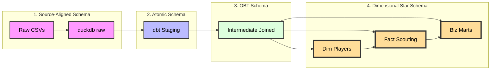

#### 2. Schema Layer Dictionary

| Schema Layer | Type | Description |
| :--- | :--- | :--- |
| **Raw** | *Source-Aligned* | Exact copy of source CSVs. Untyped strings. Split by year/category. Used for audit trails. |
| **Staging** | *Atomic* | Cleaned 1:1 views. Types cast to Int/Float. Column names normalized. Identity generated (`player_id`). |
| **Intermediate** | *One Big Table (OBT)* | Massive wide tables (100+ cols). optimized for columnar DBs (DuckDB). Joins all categories (Shooting, Passing, etc.) into one. |
| **Marts** | *Star Schema* | The final presentation layer. Separates Entities (`dim_players`) from Measurements (`mart_scouting`). Contains all business logic and KPIs. |

#### 3. Layer Details

**Staging Layer (`models/staging/`)**
*   **Goal:** Clean and normalize raw data.
*   **Operations:**
    *   **Identity Resolution:** Generates a surrogate key (`player_id`) using an MD5 hash of `Name + BirthYear + Nation` to track players across different teams and seasons.
    *   **Unioning:** Dynamically combines data from 2023, 2024, and 2025 into single streams.
    *   **Type Casting:** Converts string stats to numeric types via custom macros.

**Intermediate Layer (`models/intermediate/`)**
*   **Goal:** Assemble the "Single Source of Truth."
*   **Key Model:** `int_player_season_stats`
*   **Logic:** Joins 8+ disparate sources (Standard Stats, Shooting, Passing, Defense, Possession) into a unified wide table per player per season.

**Marts Layer (`models/marts/`)**
*   **Goal:** Business logic and KPIs for the Dashboard.
*   **Key Models:**
    *   **`mart_scouting_analysis`**: Calculates **Per 90** metrics and **Percentile Ranks** relative to the player's specific position (e.g., comparing Center Backs only to other Center Backs).
    *   **`mart_player_trends`**: Tracks career trajectory and Year-over-Year growth.
    *   **`mart_transfer_valuation`**: Algorithmic estimation of market value based on performance, age, and league strength.
    *   **`mart_squad_profile`**: Aggregates team DNA to simulate transfer suitability.

#### 4. The Serving Layer (The ERD)
We focus our Entity-Relationship Diagram (ERD) on the **Marts Layer**, as this is the "Product" exposed to the Dashboard.

We implemented a **Star Schema** variant where `dim_players` acts as the central source of truth for identity, connecting to various Fact tables (Analysis, Trends, Valuations).


## Analytics & KPIs

The platform engineers specific metrics to aid recruitment:

*   **Smart Score:** A weighted index (0-100) that changes definition based on role (e.g., a Defender's score prioritizes Interceptions/Aerials, while a Winger's prioritizes Dribbles/Key Passes).
*   **Progression Score:** `(Progressive Carries + Progressive Passes) / 90s`
*   **Final Product:** `(npxG + xAG) / 90s`
*   **Clinical Finishing:** Comparing `Goals` vs `npxG` to identify over/under-performance.

## Dashboard Features

1.  **Market Analytics:**
    *   **Magic Quadrants:** Visualize Elite vs. Developing players.
    *   **Hidden Gem Detector:** Highlight high-performing players at small clubs.
2.  **Player Deep Dive:**
    *   **Pizza Charts:** Visual percentile profile against positional peers.
    *   **Financials:** Estimated Market Value calculator.
3.  **Similarity Search:**
    *   Uses **Euclidean Distance** (KNN) to find statistical doppelgängers (e.g., "Find me a cheaper version of Rodri").

## Data Coverage

### Seasons
- 2023-2024
- 2024-2025
- 2025-2026

### Stat Categories
- Standard Stats
- Shooting
- Passing
- Pass Types
- Goal and Shot Creation
- Defensive Actions
- Possession
- Playing Time
- Miscellaneous Stats
- Goalkeeping
- Advanced Goalkeeping

## Getting Started

### Prerequisites
```bash
pip install -r requirements.txt
```

### Running the Pipeline

1. **Scrape data from FBref**:
```bash
python ingestion/fbref_scraper.py
python ingestion/scrape_glossary.py
```

2. **Load into DuckDB**:
```bash
python ingestion/load_raw.py
```

3. **Transform with dbt**:
```bash
dbt deps --project-dir transformation
dbt build --project-dir transformation
```

4. **Launch Dashboard**:
```bash
streamlit run dashboard.py
```

## Orchestration Layer (Dagster)

### Overview

The Orchestration layer coordinates the entire ELT pipeline using **Dagster**, ensuring proper sequencing, dependency management, and automated scheduling. It replaces manual script execution with a production-grade workflow engine.

### Architecture: The "Relay Race" Design

Previously, the Ingestion (Python) and Transformation (dbt) layers were disconnected "islands" that could run in parallel, causing race conditions where dbt would attempt to read data before it was loaded.

**Problem Solved:**
We implemented a **CustomDagsterDbtTranslator** that explicitly bridges the `raw_duckdb_tables` asset (Python) to the `fbref_raw` dbt source, creating a dependency graph that enforces proper execution order.

```mermaid
flowchart LR
    classDef python fill:#3776ab,stroke:#fff,stroke-width:2px,color:#fff
    classDef dbt fill:#ff694b,stroke:#fff,stroke-width:2px,color:#fff
    classDef data fill:#ffd43b,stroke:#333,stroke-width:2px,color:#000

    A[Web Scraper<br/>Python] -->|CSV Files| B[Raw CSV Files<br/>Asset]
    B -->|Load| C[DuckDB Raw Tables<br/>Python]
    C -.->|Dependencies| D[dbt Sources<br/>fbref_raw]
    D -->|Transform| E[Staging Models<br/>dbt]
    E -->|Join| F[Intermediate<br/>dbt]
    F -->|Enrich| G[Marts<br/>dbt]

    class A,C python
    class D,E,F,G dbt
    class B data
```

**Key Innovation:** The dotted line between `DuckDB Raw Tables` and `dbt Sources` is enforced by the `CustomDagsterDbtTranslator`, which maps all dbt source references to the upstream Python asset.

### Directory Structure

```
orchestrator/
├── __init__.py              # Definitions Registry (Jobs, Schedules, Resources)
├── assets/
│   ├── ingestion.py         # Python Assets (Scraper + Loader)
│   └── dbt.py               # dbt Assets + Translator Bridge
```

### Asset Definitions

#### 1. Ingestion Assets (`orchestrator/assets/ingestion.py`)

**`raw_csv_files`**
- **Type:** Python Asset
- **Function:** Executes `fbref_scraper.py` as a subprocess
- **Output:** CSV files in `data/raw/{season}/`
- **Metadata:** Logs scraper stdout

**`raw_duckdb_tables`**
- **Type:** Python Asset
- **Dependencies:** `raw_csv_files`
- **Function:** Executes `load_raw.py` to bulk load CSVs into DuckDB `raw` schema
- **Output:** DuckDB tables with metadata (row counts, table counts)
- **Connection:** Read-only connection for metadata queries to avoid locks

#### 2. dbt Assets (`orchestrator/assets/dbt.py`)

**`dbt_analytics_assets`**
- **Type:** dbt Asset Group
- **Function:** Runs `dbt build` to execute all Staging → Intermediate → Marts models
- **Translator:** `CustomDagsterDbtTranslator` maps `fbref_raw` sources to `raw_duckdb_tables`
- **Manifest:** Parses `transformation/target/manifest.json` to discover models

**Bridge Logic:**
```python
class CustomDagsterDbtTranslator(DagsterDbtTranslator):
    def get_asset_key(self, dbt_resource_props):
        # Map dbt source "fbref_raw" to upstream Python asset
        if dbt_resource_props["resource_type"] == "source":
            if dbt_resource_props["source_name"] == "fbref_raw":
                return AssetKey("raw_duckdb_tables")
        return super().get_asset_key(dbt_resource_props)
```

### Jobs & Schedules

#### Job: `refresh_scouting_platform`
- **Selection:** All Ingestion assets + All dbt assets
- **Execution Order:** Python scraper → DuckDB loader → dbt transformations
- **Purpose:** Full pipeline refresh

#### Schedule: `biweekly_refresh` (Planned)
- **Cron:** `0 4 1,15 * *` (4 AM on the 1st and 15th of every month)
- **Job:** `refresh_scouting_platform`
- **Purpose:** Automated data updates

### Resource Configuration

**DbtCliResource:**
- **Project Dir:** `/app/transformation` (Docker) or `./transformation` (Local)
- **Profiles Dir:** Same as project dir (profiles.yml location)
- **Environment:** Configured via `DBT_PROJECT_DIR` env var

### Execution Flow

1. **User Trigger:** Navigate to Dagster UI → Assets → "Materialize All"
2. **Dagster Execution:**
   - Resolves dependency graph
   - Executes `raw_csv_files` (scrapes FBref)
   - Executes `raw_duckdb_tables` (loads to DuckDB)
   - Waits for completion
   - Executes `dbt_analytics_assets` (transforms data)
3. **Result:** Fully refreshed analytical tables ready for Dashboard

### Handling Database Locks

**Challenge:** DuckDB is single-writer. If Streamlit dashboard holds a read lock, the pipeline may fail.

**Solution:**
1. **Dashboard Read-Only Mode:** `duckdb.connect('data/duckdb/players.db', read_only=True)`
   - Allows concurrent reads during pipeline writes
2. **Retry Policy (Future):** Configure Dagster to retry on lock errors with exponential backoff

### Optimization: Incremental Loading (Advanced)

For production-scale deployments, we can implement two-tier scheduling:

**Daily Job (Fast):**
- Scrapes only the active season (2025-2026)
- dbt runs incrementally (updates current season only)
- Execution time: ~2 minutes

**Monthly Job (Thorough):**
- Scrapes all historical seasons (2023-2026)
- dbt runs full refresh
- Execution time: ~15 minutes

**Implementation:**
```python
# In fbref_scraper.py
def get_target_seasons():
    if os.getenv("FULL_REFRESH", "False").lower() == "true":
        return ['2023-2024', '2024-2025', '2025-2026']
    return ['2025-2026']  # Active season only

# In orchestrator/__init__.py
incremental_job = define_asset_job(
    name="daily_active_season_update",
    selection="raw_csv_files*",
    config={"ops": {"raw_csv_files": {"env": {"FULL_REFRESH": "False"}}}}
)
```

### Monitoring & Observability

**Dagster UI Features:**
- **Asset Materialization History:** Track when each asset was last updated
- **Logs:** Real-time stdout/stderr from Python scripts and dbt
- **Metadata:** Row counts, execution time, data freshness
- **Lineage Graph:** Visual dependency tree

**Access:** `http://localhost:3000` (when running via Docker Compose)

### Pipeline Success


*Successful execution of the full ELT pipeline showing all assets materialized*

### Running the Orchestrator

**Local Development:**
```bash
# Start Dagster UI
dagster dev -m orchestrator

# Access UI at http://localhost:3000
```

**Docker (Production):**
```bash
docker-compose up dagster_webserver dagster_daemon
```

**Manual Trigger:**
1. Open Dagster UI
2. Navigate to "Assets"
3. Select all assets or specific subset
4. Click "Materialize"

**Scheduled Execution:**
1. Navigate to "Schedules" tab
2. Toggle `biweekly_refresh` to ON
3. Pipeline runs automatically at configured times

### Troubleshooting

**Issue:** `DagsterInvalidDefinitionError: Identical Dagster asset keys`
**Cause:** Multiple dbt sources mapped to same asset key
**Solution:** Ensure translator returns unique keys or properly groups sources

**Issue:** `IO Error: Could not set lock on file`
**Cause:** Dashboard holding DuckDB lock
**Solution:** 
1. Stop Streamlit: `pkill -f streamlit`
2. Ensure dashboard uses `read_only=True`
3. Retry pipeline execution

**Issue:** `Manifest not found`
**Cause:** dbt project not compiled
**Solution:** 
```bash
cd transformation
dbt compile
```

## Visualization Layer (Streamlit Dashboard)

### Overview

The **NextGen Scout Pro** dashboard is a comprehensive Streamlit application that transforms the analytical models (Marts) into an interactive scouting platform. It provides recruiters, analysts, and scouts with intuitive visualizations and data-driven insights for player evaluation.

**Tech Stack:**
- **Framework:** Streamlit (Python)
- **Visualization:** Plotly (interactive charts)
- **Database:** DuckDB (read-only connection)
- **APIs:** TheSportsDB (team badges), FlagCDN (country flags)

**Access:** `http://localhost:8501`

### Architecture

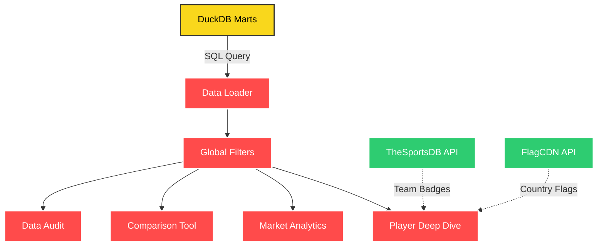

### Page Structure

#### Sidebar: Global Filters

The sidebar provides cross-page filtering capabilities that dynamically update all visualizations.

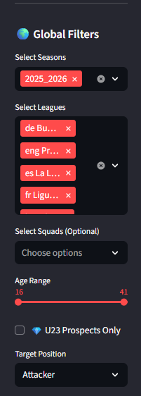
*Global filtering controls for seasons, leagues, teams, age, and position*

**Filter Components:**

1. **🌍 Season Selection** (Multi-select)
   - Options: 2023-2024, 2024-2025, 2025-2026
   - Default: Latest season
   - Purpose: Compare players across different campaign years

2. **🏆 League Filter** (Multi-select)
   - Options: Premier League, La Liga, Serie A, Bundesliga, Ligue 1
   - Default: All leagues selected
   - Purpose: Focus on specific competitions

3. **⚽ Team Filter** (Multi-select, Optional)
   - Dynamic: Updates based on selected leagues
   - Purpose: Scout specific squads or exclude top clubs

4. **📅 Age Range** (Slider)
   - Range: 15-45 years
   - Default: Full range
   - Purpose: Target specific age demographics

5. **💎 U23 Prospects Filter** (Checkbox)
   - Boolean: Show only players aged 23 or younger
   - Purpose: Identify development prospects

6. **🎯 Target Position** (Dropdown)
   - Options: Attacker, Winger/AM, Midfielder, Defender, Wingback/DM, Goalkeeper
   - Purpose: Position-specific analytics and comparisons

---

### Tab 1: 📊 Market Analytics

The primary discovery interface for identifying talent using interactive scatter plots and leaderboards.

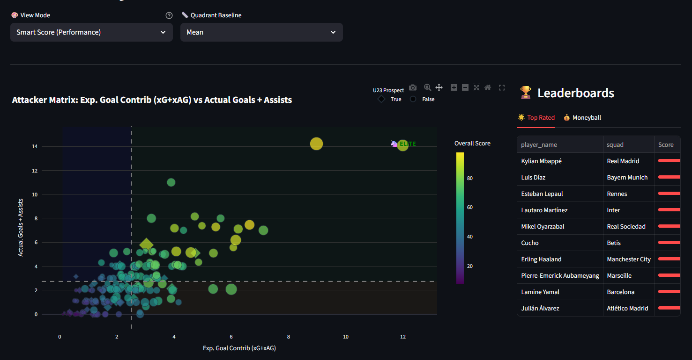
*Position-based market matrix with quadrant analysis*

#### Features

**1. View Mode Selector** (Dropdown)
- **Smart Score (Performance):** Color-codes players by composite statistical rating
- **Market Value (Moneyball):** Highlights undervalued high-performers (green = cheap, red = expensive)
- **Age (Prospects):** Color gradient from young (blue) to veteran (red)

**2. Quadrant Baseline Toggle** (Dropdown)
- **Mean:** Uses average as center point (sensitive to outliers)
- **Median:** Uses 50th percentile as center point (robust to extreme values)

**3. Interactive Scatter Plot**

The chart visualizes players in a 2D space defined by position-specific KPIs:

| Position | X-Axis | Y-Axis | Bubble Size |
|----------|--------|--------|-------------|
| **Attacker** | Expected Goal Contribution (xG+xAG) | Actual Goals + Assists | Shot Volume |
| **Winger/AM** | Key Passes per 90 | Dribbles Won per 90 | npxG |
| **Midfielder** | Progressive Pass Distance | Key Passes | Minutes Played |
| **Defender** | Interceptions per 90 | Aerials Won per 90 | Tackles Won |
| **Wingback/DM** | Tackles Won per 90 | Ball Progression Distance | Interceptions |
| **Goalkeeper** | Sweeper Actions per 90 | PSxG +/- per 90 | Clean Sheet % |

**Quadrant Interpretation:**
- 🟢 **Top Right (Elite):** High performance on both axes
- 🟠 **Bottom Right (Specialist):** Volume-focused, lower efficiency
- 🔵 **Top Left (Efficient):** High efficiency, lower volume
- ⚪ **Bottom Left (Developing):** Below average on both metrics

**Interactivity:**
- **Click on any player** → Auto-navigates to their Deep Dive profile
- **Hover** → Displays player name, club, age, season, Smart Score, market value, performance tier

**4. League Calibration (Violin Plot)**

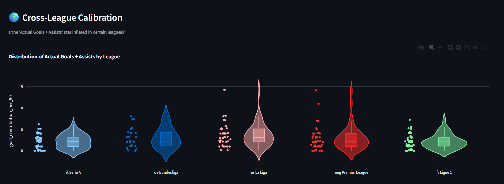
*Statistical distribution comparison across competitions*

Visualizes whether specific metrics are "inflated" in certain leagues using violin plots that show:
- Distribution density (width of violin)
- Median values (center line)
- Individual player data points
- Box plot overlay (quartiles)

**Use Case:** Determine if a player's stats in Ligue 1 would translate to the Premier League.

**5. Leaderboards** (Right Sidebar)

**Tab A: 🌟 Top Rated**
- Ranks players by **Smart Score** (composite position-specific index)
- Displays: Player Name, Squad, Score (0-100 progress bar)
- Limit: Top 10

**Tab B: 💰 Moneyball**
- Identifies **undervalued** players: Elite/High Performer tier + Market Value < €30M
- Sorted by: Ascending market value (cheapest first)
- Use Case: Find hidden gems for budget-conscious clubs

---

### Tab 2: 👤 Player Deep Dive

Comprehensive individual player analysis with scouting reports, statistical breakdowns, and similarity matching.

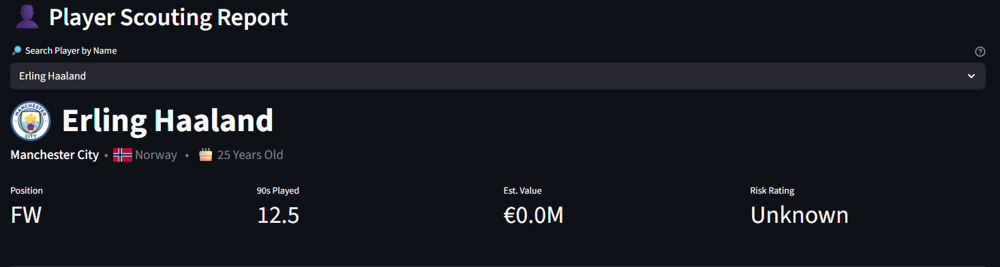
*Player bio card with team badge, flag, and U23 indicator*

#### Features

**1. Intelligent Search Bar**
- **Normalization:** Handles Unicode characters (e.g., searching "Yildiz" finds "Yıldız")
- **Auto-complete:** Dropdown with all player names
- **Session Persistence:** Remembers last viewed player
- **Click Navigation:** Clicking a player in Market Analytics auto-populates this search

**2. Player Bio Header**

Displays:
- **Player Name** (Large heading with team logo)
- **💎 U23 Prospect Badge** (if age ≤ 23)
- **Squad:** Current club
- **Nation:** Flag icon + country name
- **Age:** Current age

**3. Quick Stats Card** (4 Columns)
- **Position:** Primary role (e.g., FW, MF, DF, GK)
- **90s Played:** Total match time normalized
- **Est. Value:** Algorithmic market valuation in €M
- **Risk Rating:** Transfer risk assessment (Low/Medium/High/Unknown)

**4. Visual Profile & Scouting Notes** (2 Columns)

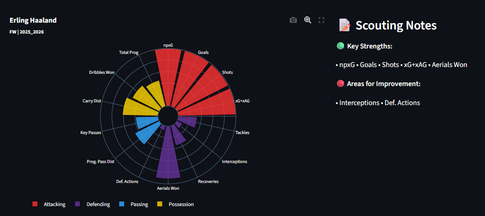
*Multi-category percentile profile (Pizza Chart)*

**Left: Pizza Chart**
- **Metrics:** 12-16 KPIs grouped by category
  - **Attacking:** Goals, Shots, npxG, Touches in Box
  - **Passing:** Passes Completed, Progressive Passes, Key Passes
  - **Possession:** Touches, Carries, Dribbles, Progressive Carries
  - **Defending:** Tackles, Interceptions, Blocks, Aerials
  - *(For GKs: Shot Stopping, Distribution, Sweeping, Command)*
- **Calculation:** Percentile rank vs. positional peers in the same season
- **Visualization:** Polar bar chart with color-coded categories
- **Hover:** Shows raw value + percentile

**Right: Automated Scouting Notes**
- **🟢 Key Strengths:** Metrics where player is in top 25% (75th+ percentile)
- **🔴 Areas for Improvement:** Metrics where player is in bottom 25% (25th- percentile)
- **Context:** Limited to top 5 items each to avoid clutter

**5. Season Deep Dive** (Tabbed Layout)

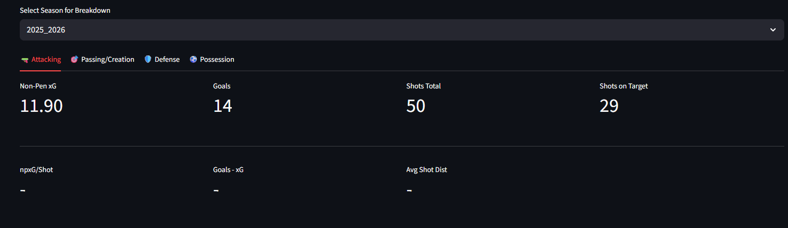
*Detailed categorical statistics for selected season*

**Season Selector:** Dropdown to analyze specific campaigns (2023-2024, 2024-2025, 2025-2026)

**For Outfielders (4 Tabs):**
- **🔫 Attacking:** Goals, xG, Shots, Shot Accuracy, Shot Distance, Goals vs xG
- **🎯 Passing/Creation:** Assists, xAG, Key Passes, Progressive Passes, Passes into Box, Through Balls, Crosses
- **🛡️ Defense:** Tackles, Interceptions, Blocks, Recoveries, Aerials, Fouls
- **⚽ Possession:** Touches, Progressive Carries, Take-ons, Carries into Box, Miscontrols, Dispossessions

**For Goalkeepers (3 Tabs):**
- **🧤 Shot Stopping:** PSxG +/-, Save %, Goals Against, Clean Sheet %
- **🧹 Sweeping:** Sweeper Actions, Crosses Stopped %, Avg Defensive Distance
- **📢 Distribution:** Long Pass %, Avg Pass Length, Goal Kick Launch %

**Display Format:** 4-column metric grid with safe handling for missing data

**6. Multidimensional Evolution** (Line + Bar Chart)

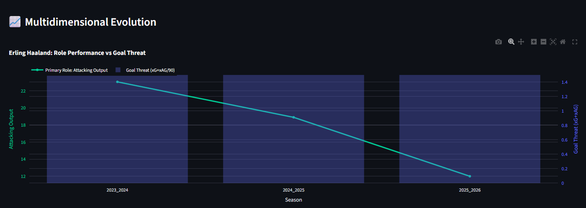
*Career trajectory showing role performance vs. goal threat over time*

- **Primary Axis (Line):** Role-specific specialist index
  - Defenders: Defensive Actions per 90
  - Midfielders: Ball Progression Yards per 90
  - Attackers: Attacking Output (xG+xAG)
  - Goalkeepers: Shot Stopping (PSxG +/-)
- **Secondary Axis (Bar):** Goal Threat (xG+xAG per 90) - Only for outfielders
- **Purpose:** Identify if a midfielder is evolving into a goal-scoring threat, or if a defender maintains consistency

**7. Statistical Doppelgängers** (Similarity Search)

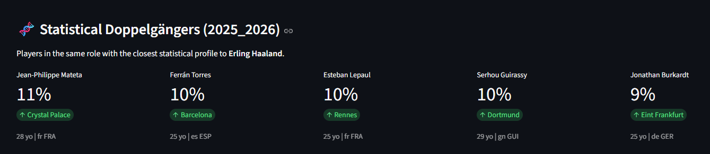
*Top 5 most similar players using KNN distance metric*

**Algorithm:**
- **Feature Space:** All numeric metrics from the selected season
- **Normalization:** Z-score standardization (to prevent bias toward high-volume stats)
- **Distance Metric:** Euclidean distance in normalized space
- **Output:** Top 5 closest matches (excluding the player themselves)

**Display:**
- **Similarity Score:** 0-100% (higher = more similar)
- **Player Name, Club, Age, Nation**

**Use Case:** "Find me a cheaper/younger version of Declan Rice"

---

### Tab 3: ⚖️ Comparison

Head-to-head player comparison with dual radar charts and detailed metric tables.

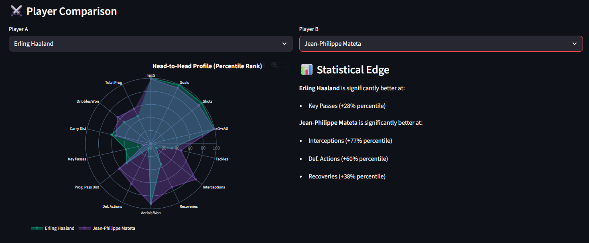
*Head-to-head statistical profile with percentile overlays*

#### Features

**1. Dual Search Bars**
- **Player A:** Left dropdown (normalized search)
- **Player B:** Right dropdown (normalized search)
- **Default:** Auto-selects first two players from filtered dataset

**2. Radar Chart (Overlapping)**
- **Player A:** Green trace
- **Player B:** Purple trace
- **Metrics:** Same as Pizza Chart (12-16 KPIs)
- **Values:** Percentile ranks (0-100 scale)
- **Hover:** Unified tooltip on hover for easy comparison

**3. Statistical Edge Summary**

**🟢 Player A Advantages:**
- Lists metrics where Player A is **+15 percentile points** better
- Example: "Progressive Passes (+23% percentile)"

**🟣 Player B Advantages:**
- Lists metrics where Player B is **+15 percentile points** better

**Neutral:** Displays "These players have very similar statistical profiles" if no significant differences

**4. Detailed Metrics Table**

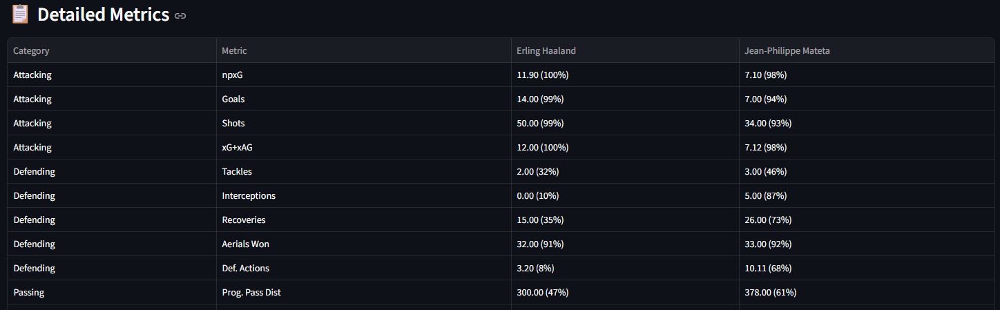
*Side-by-side raw values with percentile ranks*

**Columns:**
- **Category:** Attacking, Passing, Possession, Defending
- **Metric:** Stat name
- **Player A:** Raw Value (Percentile %)
- **Player B:** Raw Value (Percentile %)

**Sorting:** Grouped by category for logical flow

**Use Case:** "Should we sign Player A or Player B for the same price?"

---

### Tab 4: 🕒 Data Audit

Operational transparency dashboard for data quality monitoring and ingestion tracking.
#### Features

**1. Database Statistics** (2 Columns)
- **Total Players (Marts):** Row count from `mart_scouting_analysis`
- **Last Data Update:** Most recent `load_timestamp` from raw tables

**2. Recently Added/Updated Players Table**

**Query:** Fetches the 20 most recent records from the latest season's raw table based on `load_timestamp`

**Columns:**
- **Player Name**
- **Squad**
- **Loaded At:** Timestamp of data ingestion

**Purpose:**
- Verify pipeline executed successfully
- Identify when specific players were last updated
- Audit data freshness for compliance

**Error Handling:**
- Displays friendly error message if `load_timestamp` column is missing
- Gracefully handles missing Marts tables (during development)

---

### Data Enrichment APIs

**1. Team Badges** (TheSportsDB)
- **Endpoint:** `https://www.thesportsdb.com/api/v1/json/3/searchteams.php?t={team_name}`
- **Cache:** 1 hour TTL
- **Fallback:** No badge displayed if API fails

**2. Country Flags** (FlagCDN)
- **Endpoint:** `https://flagcdn.com/h24/{country_code}.png`
- **Normalization:** Handles ISO Alpha-3 codes (e.g., ENG → gb-eng)
- **Manual Overrides:** Special cases for UK nations, USA, Korea, Türkiye

**3. Unicode Name Normalization**
- **Problem:** Search for "Yildiz" wouldn't match "Yıldız"
- **Solution:** NFD decomposition + accent stripping
- **Supported:** Turkish (ı, İ), Scandinavian (ø), German (ß), and all accented Latin characters

---

### Performance Optimizations

**1. Caching Strategy**
- **`@st.cache_resource`:** DuckDB connection (persistent across sessions)
- **`@st.cache_data`:** Data loads, API calls (TTL: 1 hour)
- **Benefit:** Dashboard loads in <2 seconds after initial cache

**2. Read-Only Database Connection**
```python
duckdb.connect('data/duckdb/players.db', read_only=True)
```
- **Prevents:** IO lock errors when pipeline runs concurrently
- **Trade-off:** Dashboard must be restarted to see new data (acceptable for scheduled pipelines)

**3. Lazy Loading**
- **Approach:** Only query Marts when tab is activated
- **Result:** Initial page load only fetches outfielder data; GK data loads on-demand

---

### User Workflows

**Workflow 1: Discover Undervalued Talent**
1. **Sidebar:** Select "Midfielder" + "U23 Prospects Only" + Premier League
2. **Tab 1:** Switch View Mode to "Market Value (Moneyball)"
3. **Scatter Plot:** Identify green bubbles (cheap) in Elite Quadrant (top-right)
4. **Leaderboard:** Check "💰 Moneyball" tab for sorted list
5. **Click Player:** Auto-navigate to Deep Dive for confirmation

**Workflow 2: Find Replacement for Injured Player**
1. **Tab 2:** Search injured player (e.g., "Declan Rice")
2. **Scroll to "Statistical Doppelgängers"**
3. **Note Top 5:** Review similarity scores
4. **Tab 3:** Compare injured player vs. top doppelgänger
5. **Decision:** Evaluate if replacement fits tactical system

**Workflow 3: Monitor Data Pipeline**
1. **Tab 4:** Check "Last Data Update" timestamp
2. **Verify:** Should match scheduled pipeline execution (e.g., 4 AM on 1st/15th)
3. **Audit Table:** Confirm new players appear in "Recently Added/Updated"
4. **Action:** If stale, investigate Dagster logs

---

### Deployment

**Local Development:**
```bash
streamlit run dashboard.py --server.port 8501 --server.address 0.0.0.0
```

**Docker (Background):**
```bash
docker-compose up -d streamlit
```

**Access:** `http://localhost:8501`

**Restarting (to refresh data after pipeline run):**
```bash
# Local
pkill -f streamlit
streamlit run dashboard.py

# Docker
docker-compose restart streamlit
```

---

### Future Enhancements

**Planned Features:**
1. **Export Reports:** PDF generation of player profiles
2. **Watch List:** Persistent favorites across sessions
3. **Comparison Matrix:** Compare 3+ players simultaneously
4. **Transfer Simulation:** "What if Player X joined Squad Y?" tactical fit analysis
5. **Mobile Responsive:** Optimized layouts for tablets/phones

## License

This project is for educational and research purposes.
