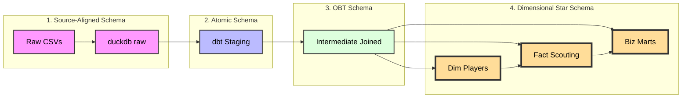

# NextGenEUPlayers - DuckDB ELT Pipeline

A robust ELT pipeline for scraping and analyzing player statistics from FBref for the Big Five European Leagues across multiple seasons (2023-2026).


## Overview

This project implements a complete data pipeline that:
1. **Extracts** player statistics from fbref.com
2. **Loads** raw data into DuckDB
3. **Profiles** data quality and schema
4. **Transforms** data into a clean staging schema ready for analysis
5. **Analyzes** data using a Streamlit dashboard

## Directory Structure

```
NextGenEUPlayers/
├── ingestion/
│   ├── fbref_scraper.py      # Extract: Web -> CSV
│   ├── scrape_glossary.py    # Extract: Glossary -> CSV
│   ├── load_raw.py           # Load: CSV -> DuckDB (raw schema)
│   ├── profile_raw.py        # Profile: Analyze raw schema stats
│   └── transform_stage.py    # (Deprecated) Old transformation script
├── transformation/           # [T] dbt Project
│   ├── models/
│   │   ├── staging/          # Cleaning & Normalization
│   │   ├── intermediate/     # Joins & Logic
│   │   └── marts/            # Final Scouting Tables
│   ├── macros/               # Reusable SQL logic
│   └── tests/                # Data Integrity Tests
├── data/
│   ├── raw/                  # Raw CSVs by season
│   ├── glossary/             # Column definition glossary
│   ├── reports/              # Data profiling reports
│   └── duckdb/               # players.db database
├── dashboard.py              # The Scouting App (Streamlit)
├── schemas/
│   └── raw/                  # Schema documentation
├── scripts/
│   └── profile_raw_schema.py # Schema profiling utilities
└── requirements.txt
```

## Pipeline Stages

### 1. Extract (Web -> CSV)
- **`fbref_scraper.py`**: Scrapes player statistics from FBref
- **`scrape_glossary.py`**: Extracts column definitions and glossary

### 2. Load (CSV -> DuckDB Raw Schema)
- **`load_raw.py`**: Loads raw CSVs into DuckDB `raw` schema
- Preserves original column names and data types
- Organizes data by season and stat category

### 3. Profile (Data Quality Analysis)
- **`profile_raw.py`**: Analyzes raw schema for:
  - Column names and positions
  - Inferred data types
  - NULL value counts
  - Total row counts
  - Glossary coverage
- **Output**: `data/reports/raw_profile.csv` or Markdown report

### 4. Transform (dbt Architecture)

We utilize a **Medallion Architecture** within dbt to turn messy web data into actionable intelligence.

#### 1. The Data Lineage (The Flow)
This diagram illustrates the transformation journey from raw web data to the final analytical tables.



#### 2. Schema Layer Dictionary

| Schema Layer | Type | Description |
| :--- | :--- | :--- |
| **Raw** | *Source-Aligned* | Exact copy of source CSVs. Untyped strings. Split by year/category. Used for audit trails. |
| **Staging** | *Atomic* | Cleaned 1:1 views. Types cast to Int/Float. Column names normalized. Identity generated (`player_id`). |
| **Intermediate** | *One Big Table (OBT)* | Massive wide tables (100+ cols). optimized for columnar DBs (DuckDB). Joins all categories (Shooting, Passing, etc.) into one. |
| **Marts** | *Star Schema* | The final presentation layer. Separates Entities (`dim_players`) from Measurements (`mart_scouting`). Contains all business logic and KPIs. |

#### 3. Layer Details

**Staging Layer (`models/staging/`)**
*   **Goal:** Clean and normalize raw data.
*   **Operations:**
    *   **Identity Resolution:** Generates a surrogate key (`player_id`) using an MD5 hash of `Name + BirthYear + Nation` to track players across different teams and seasons.
    *   **Unioning:** Dynamically combines data from 2023, 2024, and 2025 into single streams.
    *   **Type Casting:** Converts string stats to numeric types via custom macros.

**Intermediate Layer (`models/intermediate/`)**
*   **Goal:** Assemble the "Single Source of Truth."
*   **Key Model:** `int_player_season_stats`
*   **Logic:** Joins 8+ disparate sources (Standard Stats, Shooting, Passing, Defense, Possession) into a unified wide table per player per season.

**Marts Layer (`models/marts/`)**
*   **Goal:** Business logic and KPIs for the Dashboard.
*   **Key Models:**
    *   **`mart_scouting_analysis`**: Calculates **Per 90** metrics and **Percentile Ranks** relative to the player's specific position (e.g., comparing Center Backs only to other Center Backs).
    *   **`mart_player_trends`**: Tracks career trajectory and Year-over-Year growth.
    *   **`mart_transfer_valuation`**: Algorithmic estimation of market value based on performance, age, and league strength.
    *   **`mart_squad_profile`**: Aggregates team DNA to simulate transfer suitability.

#### 4. The Serving Layer (The ERD)
We focus our Entity-Relationship Diagram (ERD) on the **Marts Layer**, as this is the "Product" exposed to the Dashboard.

We implemented a **Star Schema** variant where `dim_players` acts as the central source of truth for identity, connecting to various Fact tables (Analysis, Trends, Valuations).


## Analytics & KPIs

The platform engineers specific metrics to aid recruitment:

*   **Smart Score:** A weighted index (0-100) that changes definition based on role (e.g., a Defender's score prioritizes Interceptions/Aerials, while a Winger's prioritizes Dribbles/Key Passes).
*   **Progression Score:** `(Progressive Carries + Progressive Passes) / 90s`
*   **Final Product:** `(npxG + xAG) / 90s`
*   **Clinical Finishing:** Comparing `Goals` vs `npxG` to identify over/under-performance.

## Dashboard Features

1.  **Market Analytics:**
    *   **Magic Quadrants:** Visualize Elite vs. Developing players.
    *   **Hidden Gem Detector:** Highlight high-performing players at small clubs.
2.  **Player Deep Dive:**
    *   **Pizza Charts:** Visual percentile profile against positional peers.
    *   **Financials:** Estimated Market Value calculator.
3.  **Similarity Search:**
    *   Uses **Euclidean Distance** (KNN) to find statistical doppelgängers (e.g., "Find me a cheaper version of Rodri").

## Data Coverage

### Seasons
- 2023-2024
- 2024-2025
- 2025-2026

### Stat Categories
- Standard Stats
- Shooting
- Passing
- Pass Types
- Goal and Shot Creation
- Defensive Actions
- Possession
- Playing Time
- Miscellaneous Stats
- Goalkeeping
- Advanced Goalkeeping

## Getting Started

### Prerequisites
```bash
pip install -r requirements.txt
```

### Running the Pipeline

1. **Scrape data from FBref**:
```bash
python ingestion/fbref_scraper.py
python ingestion/scrape_glossary.py
```

2. **Load into DuckDB**:
```bash
python ingestion/load_raw.py
```

3. **Transform with dbt**:
```bash
dbt deps --project-dir transformation
dbt build --project-dir transformation
```

4. **Launch Dashboard**:
```bash
streamlit run dashboard.py
```

## Orchestration Layer (Dagster)

### Overview

The Orchestration layer coordinates the entire ELT pipeline using **Dagster**, ensuring proper sequencing, dependency management, and automated scheduling. It replaces manual script execution with a production-grade workflow engine.

### Architecture: The "Relay Race" Design

Previously, the Ingestion (Python) and Transformation (dbt) layers were disconnected "islands" that could run in parallel, causing race conditions where dbt would attempt to read data before it was loaded.

**Problem Solved:**
We implemented a **CustomDagsterDbtTranslator** that explicitly bridges the `raw_duckdb_tables` asset (Python) to the `fbref_raw` dbt source, creating a dependency graph that enforces proper execution order.

```mermaid
flowchart LR
    classDef python fill:#3776ab,stroke:#fff,stroke-width:2px,color:#fff
    classDef dbt fill:#ff694b,stroke:#fff,stroke-width:2px,color:#fff
    classDef data fill:#ffd43b,stroke:#333,stroke-width:2px,color:#000

    A[Web Scraper<br/>Python] -->|CSV Files| B[Raw CSV Files<br/>Asset]
    B -->|Load| C[DuckDB Raw Tables<br/>Python]
    C -.->|Dependencies| D[dbt Sources<br/>fbref_raw]
    D -->|Transform| E[Staging Models<br/>dbt]
    E -->|Join| F[Intermediate<br/>dbt]
    F -->|Enrich| G[Marts<br/>dbt]

    class A,C python
    class D,E,F,G dbt
    class B data
```



**Key Innovation:** The dotted line between `DuckDB Raw Tables` and `dbt Sources` is enforced by the `CustomDagsterDbtTranslator`, which maps all dbt source references to the upstream Python asset.

### Directory Structure

```
orchestrator/
├── __init__.py              # Definitions Registry (Jobs, Schedules, Resources)
├── assets/
│   ├── ingestion.py         # Python Assets (Scraper + Loader)
│   └── dbt.py               # dbt Assets + Translator Bridge
```

### Asset Definitions

#### 1. Ingestion Assets (`orchestrator/assets/ingestion.py`)

**`raw_csv_files`**
- **Type:** Python Asset
- **Function:** Executes `fbref_scraper.py` as a subprocess
- **Output:** CSV files in `data/raw/{season}/`
- **Metadata:** Logs scraper stdout

**`raw_duckdb_tables`**
- **Type:** Python Asset
- **Dependencies:** `raw_csv_files`
- **Function:** Executes `load_raw.py` to bulk load CSVs into DuckDB `raw` schema
- **Output:** DuckDB tables with metadata (row counts, table counts)
- **Connection:** Read-only connection for metadata queries to avoid locks

#### 2. dbt Assets (`orchestrator/assets/dbt.py`)

**`dbt_analytics_assets`**
- **Type:** dbt Asset Group
- **Function:** Runs `dbt build` to execute all Staging → Intermediate → Marts models
- **Translator:** `CustomDagsterDbtTranslator` maps `fbref_raw` sources to `raw_duckdb_tables`
- **Manifest:** Parses `transformation/target/manifest.json` to discover models

**Bridge Logic:**
```python
class CustomDagsterDbtTranslator(DagsterDbtTranslator):
    def get_asset_key(self, dbt_resource_props):
        # Map dbt source "fbref_raw" to upstream Python asset
        if dbt_resource_props["resource_type"] == "source":
            if dbt_resource_props["source_name"] == "fbref_raw":
                return AssetKey("raw_duckdb_tables")
        return super().get_asset_key(dbt_resource_props)
```

### Jobs & Schedules

#### Job: `refresh_scouting_platform`
- **Selection:** All Ingestion assets + All dbt assets
- **Execution Order:** Python scraper → DuckDB loader → dbt transformations
- **Purpose:** Full pipeline refresh

#### Schedule: `biweekly_refresh` (Planned)
- **Cron:** `0 4 1,15 * *` (4 AM on the 1st and 15th of every month)
- **Job:** `refresh_scouting_platform`
- **Purpose:** Automated data updates

### Resource Configuration

**DbtCliResource:**
- **Project Dir:** `/app/transformation` (Docker) or `./transformation` (Local)
- **Profiles Dir:** Same as project dir (profiles.yml location)
- **Environment:** Configured via `DBT_PROJECT_DIR` env var

### Execution Flow

1. **User Trigger:** Navigate to Dagster UI → Assets → "Materialize All"
2. **Dagster Execution:**
   - Resolves dependency graph
   - Executes `raw_csv_files` (scrapes FBref)
   - Executes `raw_duckdb_tables` (loads to DuckDB)
   - Waits for completion
   - Executes `dbt_analytics_assets` (transforms data)
3. **Result:** Fully refreshed analytical tables ready for Dashboard

### Handling Database Locks

**Challenge:** DuckDB is single-writer. If Streamlit dashboard holds a read lock, the pipeline may fail.

**Solution:**
1. **Dashboard Read-Only Mode:** `duckdb.connect('data/duckdb/players.db', read_only=True)`
   - Allows concurrent reads during pipeline writes
2. **Retry Policy (Future):** Configure Dagster to retry on lock errors with exponential backoff

### Optimization: Incremental Loading (Advanced)

For production-scale deployments, we can implement two-tier scheduling:

**Daily Job (Fast):**
- Scrapes only the active season (2025-2026)
- dbt runs incrementally (updates current season only)
- Execution time: ~2 minutes

**Monthly Job (Thorough):**
- Scrapes all historical seasons (2023-2026)
- dbt runs full refresh
- Execution time: ~15 minutes

**Implementation:**
```python
# In fbref_scraper.py
def get_target_seasons():
    if os.getenv("FULL_REFRESH", "False").lower() == "true":
        return ['2023-2024', '2024-2025', '2025-2026']
    return ['2025-2026']  # Active season only

# In orchestrator/__init__.py
incremental_job = define_asset_job(
    name="daily_active_season_update",
    selection="raw_csv_files*",
    config={"ops": {"raw_csv_files": {"env": {"FULL_REFRESH": "False"}}}}
)
```

### Monitoring & Observability

**Dagster UI Features:**
- **Asset Materialization History:** Track when each asset was last updated
- **Logs:** Real-time stdout/stderr from Python scripts and dbt
- **Metadata:** Row counts, execution time, data freshness
- **Lineage Graph:** Visual dependency tree

**Access:** `http://localhost:3000` (when running via Docker Compose)

### Pipeline Success


*Successful execution of the full ELT pipeline showing all assets materialized*

### Running the Orchestrator

**Local Development:**
```bash
# Start Dagster UI
dagster dev -m orchestrator

# Access UI at http://localhost:3000
```

**Docker (Production):**
```bash
docker-compose up dagster_webserver dagster_daemon
```

**Manual Trigger:**
1. Open Dagster UI
2. Navigate to "Assets"
3. Select all assets or specific subset
4. Click "Materialize"

**Scheduled Execution:**
1. Navigate to "Schedules" tab
2. Toggle `biweekly_refresh` to ON
3. Pipeline runs automatically at configured times

### Troubleshooting

**Issue:** `DagsterInvalidDefinitionError: Identical Dagster asset keys`
**Cause:** Multiple dbt sources mapped to same asset key
**Solution:** Ensure translator returns unique keys or properly groups sources

**Issue:** `IO Error: Could not set lock on file`
**Cause:** Dashboard holding DuckDB lock
**Solution:** 
1. Stop Streamlit: `pkill -f streamlit`
2. Ensure dashboard uses `read_only=True`
3. Retry pipeline execution

**Issue:** `Manifest not found`
**Cause:** dbt project not compiled
**Solution:** 
```bash
cd transformation
dbt compile
```

## License

This project is for educational and research purposes.
