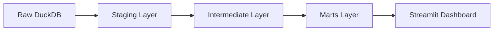

# Transformation Layer Documentation (dbt)

This directory contains the **dbt (data build tool)** project for the `NextGenEUPlayers` scouting platform. It handles the transformation of raw football data (scraped from FBref) into clean, analytical models ready for the dashboard.

## 🏗 Architecture & Lineage

The transformation pipeline follows a standard **Staging -> Intermediate -> Marts** architecture:



### 1. Staging Layer (`models/staging/`)
**Purpose:** Clean, standardize, and type-cast raw data. 1:1 mapping with raw CSV files.
- **Source:** `raw` schema in DuckDB (loaded from CSVs).
- **Key Actions:**
    - Renaming columns to `snake_case`.
    - Casting types (String -> Integer/Float).
    - Handling NULLs.
    - Generating surrogate keys (`player_id`).
- **Models:**
    - `general/`: `stg_fbref__standard`, `stg_fbref__playing_time`, `stg_fbref__misc`
    - `attack/`: `stg_fbref__shooting`, `stg_fbref__creation`
    - `distribution/`: `stg_fbref__passing`, `stg_fbref__possession`
    - `defense/`: `stg_fbref__defense`

### 2. Intermediate Layer (`models/intermediate/`)
**Purpose:** Join disparate data sources into coherent entities.
- **Key Model:** `int_player_season_stats.sql`
- **Logic:**
    - Joins all 8 staging models on `player_id`, `season_id`, and `squad`.
    - Creates a "Wide" table containing every available statistic for a player in a specific season.
    - Handles data granularity issues (ensuring 1 row per player-season-squad).

### 3. Marts Layer (`models/marts/`)
**Purpose:** Business logic, KPIs, and final presentation tables.
- **`dim_players.sql`**: Unique list of players with static attributes (DOB, Nation).
- **`mart_scouting_analysis.sql`**: The main table used by the dashboard.
    - **Filters:** Excludes players with minimal playing time (< 5.0 90s).
    - **Calculations:**
        - **Per 90 Metrics:** Normalizes volume stats (Goals -> Goals/90).
        - **KPIs:** `progression_score`, `final_product_score`, `defensive_workrate`.
        - **Percentiles:** Calculates `PERCENT_RANK()` over window functions partitioned by Position and Season.
        - **Flags:** `is_u23_prospect` (Age <= 23).

---

## 🛠 Macros (`macros/cleaning_macros.sql`)

Custom functions used to standardize data cleaning:

| Macro | Description | Usage |
| :--- | :--- | :--- |
| `generate_player_id` | Creates a surrogate key using MD5 hash of Name + Born + Nation. | `{{ generate_player_id('player', 'born', 'nation') }}` |
| `clean_numeric` | Removes commas and casts to numeric types. | `{{ clean_numeric('min') }}` |
| `clean_age` | Extracts the year from "23-154" format. | `{{ clean_age('age') }}` |
| `safe_divide` | Handles division by zero, returning 0 instead of error. | `{{ safe_divide('goals', '90s') }}` |

---

## 🚀 How to Run

### Prerequisites
- Docker container running (contains `dbt-duckdb`).
- Raw data loaded into `data/duckdb/players.db`.

### Commands
Run these commands from the `transformation/` directory:

1.  **Install Dependencies:**
    ```bash
    dbt deps
    ```

2.  **Test Source Data:**
    ```bash
    dbt test --select source:*
    ```

3.  **Run Models:**
    ```bash
    dbt run
    ```
    *To run a specific layer:* `dbt run --select tag:staging`

4.  **Test Models:**
    ```bash
    dbt test
    ```

5.  **Generate Documentation (Static Site):**
    ```bash
    dbt docs generate
    dbt docs serve
    ```

## 📊 Key Business Logic

### Scouting KPIs
The `mart_scouting_analysis` model calculates specific scores to help identify talent:

- **Progression Score:** `(Progressive Carries + Progressive Passes) / 90s`
- **Final Product:** `(Non-Penalty xG + xAG) / 90s`
- **Defensive Workrate:** `(Tackles Won + Interceptions + Recoveries) / 90s`

### Percentile Rankings
Players are ranked against their peers in the same **Season** and **Primary Position**.
- A percentile of `0.90` means the player is in the top 10% for that metric.
